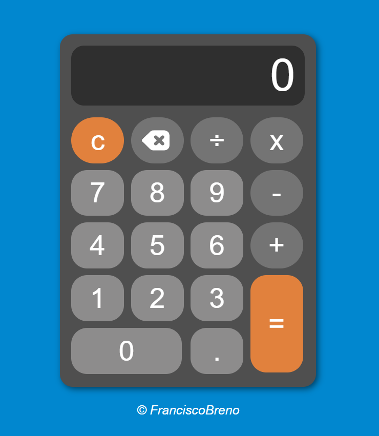
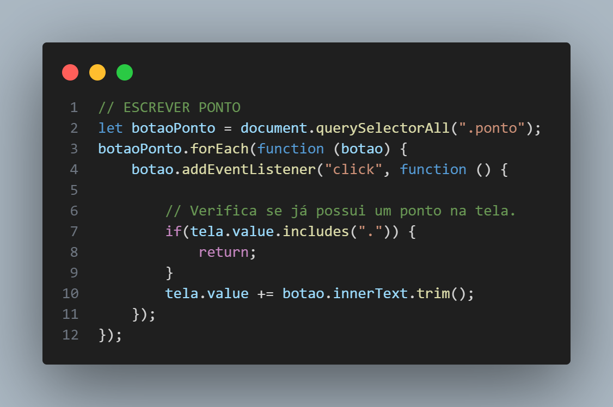
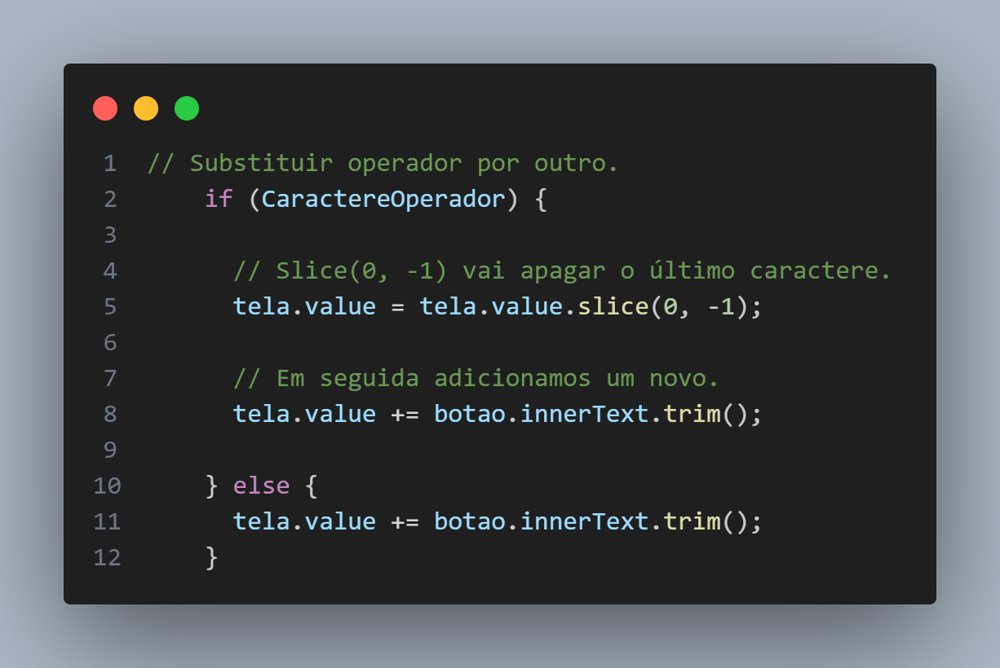
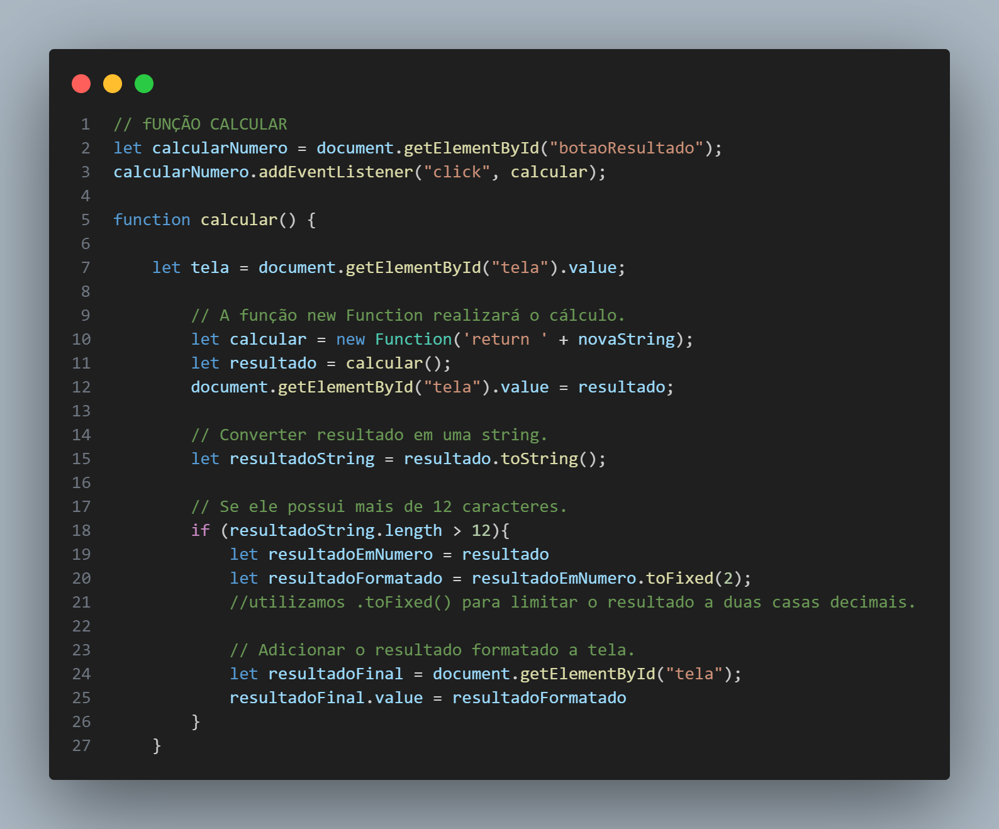

# Introdução

Este projeto é uma calculadora simples criada com HTML, JavaScript e CSS. Foi desenvolvido como parte do aprendizado dessas tecnologias, com foco especial na interação entre botões usando JavaScript.

## 👀 Ver projeto

Acesse o link [aqui](https://brenolira01.github.io/Calculadora-Javascript/).

  

# Dificuldades Enfrentadas 💪

A parte mais desafiadora foi impedir a repetição do ponto e evitar a adição de operadores consecutivos. Além disso, a implementação da notação científica.

## Como impedir a repetição do ponto ? 🤔

Neste trecho de código, verificamos se já existe um ponto na tela com o método `includes()`. Isso impede a adição de mais de um ponto decimal quando o botão de ponto é clicado.

Essa abordagem visa evitar a entrada de números inválidos, garantindo que apenas um ponto decimal seja adicionado à tela.

## Como evitar a adição de operadores consecutivos ? 🤔

Neste trecho, obtemos o último caractere da tela para determinar se é um operador. Isso é realizado utilizando o método `slice()` seguido pelo `includes()`.

Posteriormente, com o uso de `if` e `else`, verificamos se o último caractere na tela é um operador. Caso seja, permitimos a substituição, possibilitando a troca de um operador por outro, se necessário.

## Como implementar notação científica ? 🤔

Para isso, vamos converter o resultado em uma string utilizando `.toString()`, a fim de obter seu tamanho. Isso nos permite verificar se ele ultrapassa 12 caracteres.

Se for maior, utilizamos o método `.toFixed()` para limitar o resultado a duas casas decimais, e em seguida o adicionamos à tela.

Decidi utilizar a função `new Function()` em lugar de `eval()` por razões de segurança.

## 🧠 Tecnologias Utilizadas

  

## 🔍 Fontes

Os elementos adicionados ou modificados neste projeto foram obtidos de diversas fontes. Abaixo está a lista de onde cada elemento foi encontrado:

- **Ícone de apagar**: Fonte: <a href="https://icon-icons.com/pt/icone/retrocesso/152694" title="retrocesso ícones">Ícones criados por Tailwind Labs - icon-icons</a>
- **Ícone de github**: Fonte: <a href="https://www.flaticon.com/br/icones-gratis/github" title="github ícones">Github ícones criados por Pixel perfect - Flaticon</a>
- **Ícone de linkedin**: Fonte: <a href="https://www.flaticon.com/br/icones-gratis/linkedin" title="linkedin ícones">Linkedin ícones criados por Freepik - Flaticon</a>

Agradeço aos criadores originais por disponibilizarem esses recursos.

## 🌱 Contribuições

Contribuições são bem-vindas! Sinta-se à vontade para abrir problemas e solicitações de pull para melhorar este projeto.

## Autor

Feito por [Francisco Breno](https://www.linkedin.com/in/breno-lira-perfil).

## 📫 Contato

## 📄 Licença

Este projeto é licenciado sob os termos da [Licença MIT](/LICENSE.txt).
Leia o arquivo [LICENSE](/LICENSE.txt) para obter mais detalhes sobre as permissões e restrições da Licença MIT.
