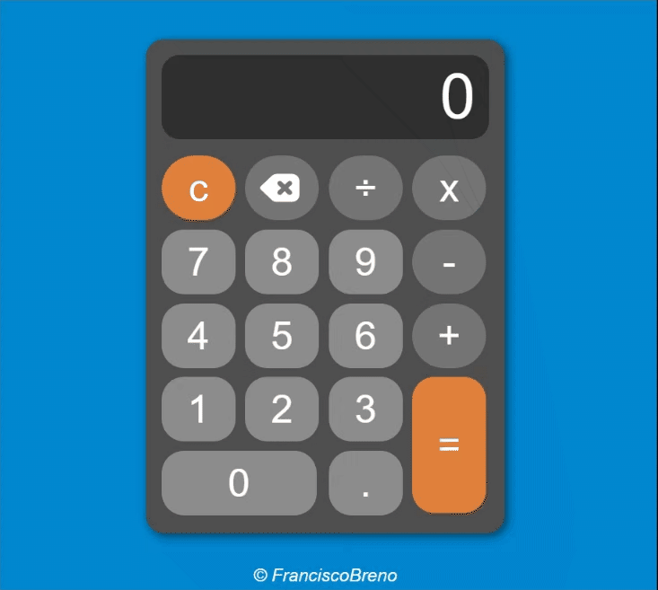
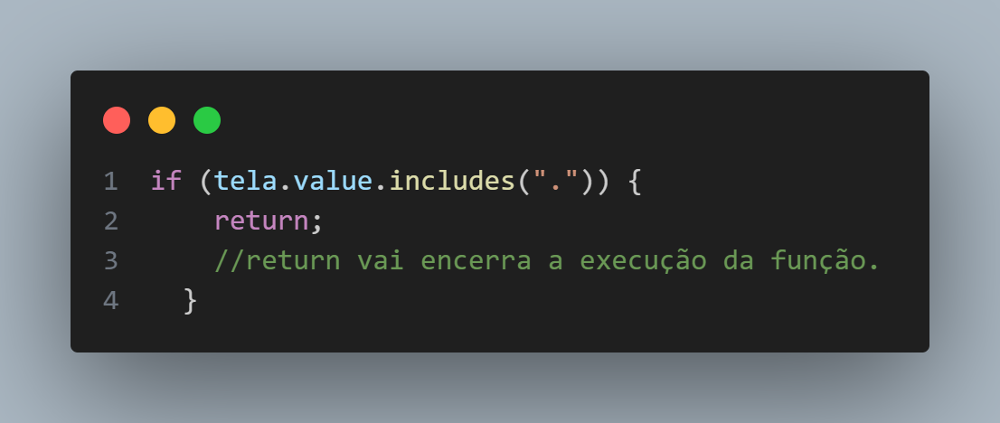
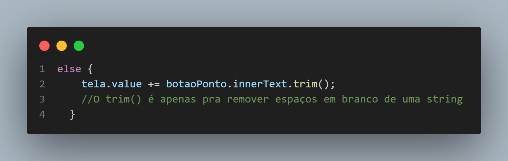
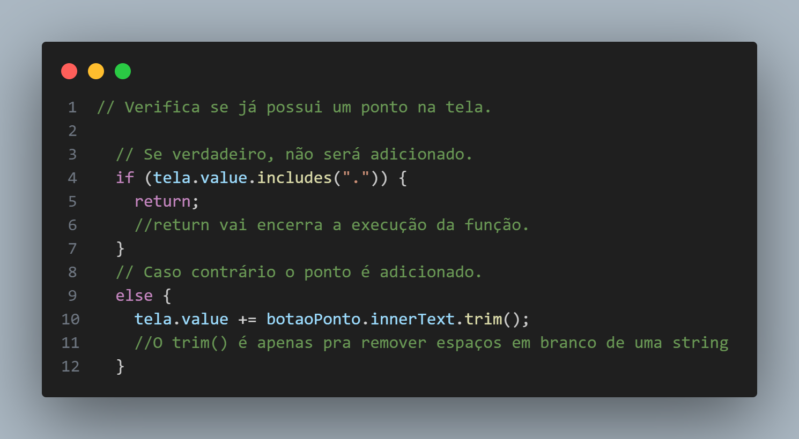
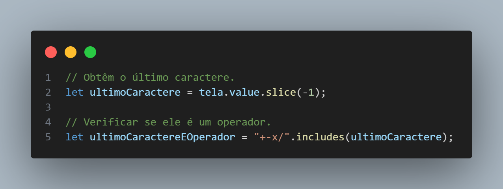
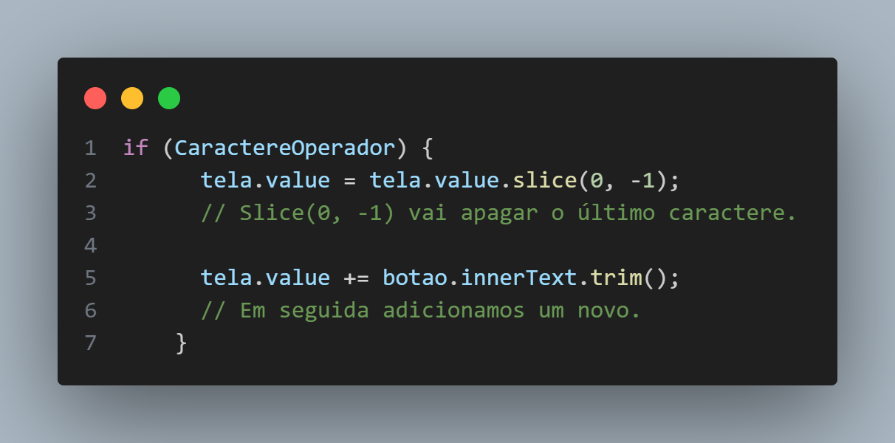
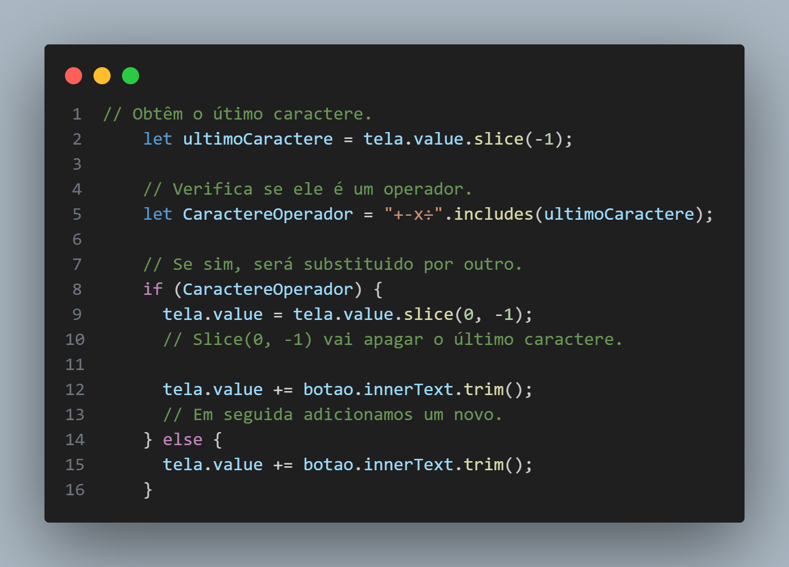
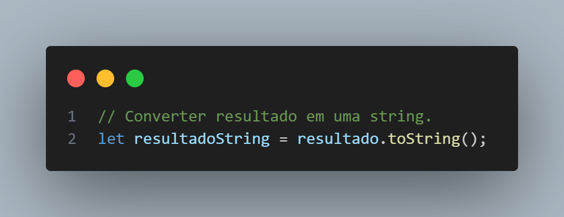
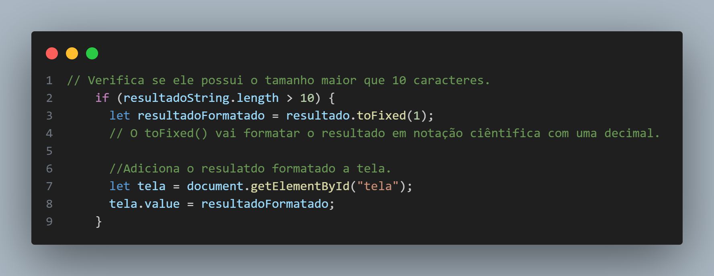
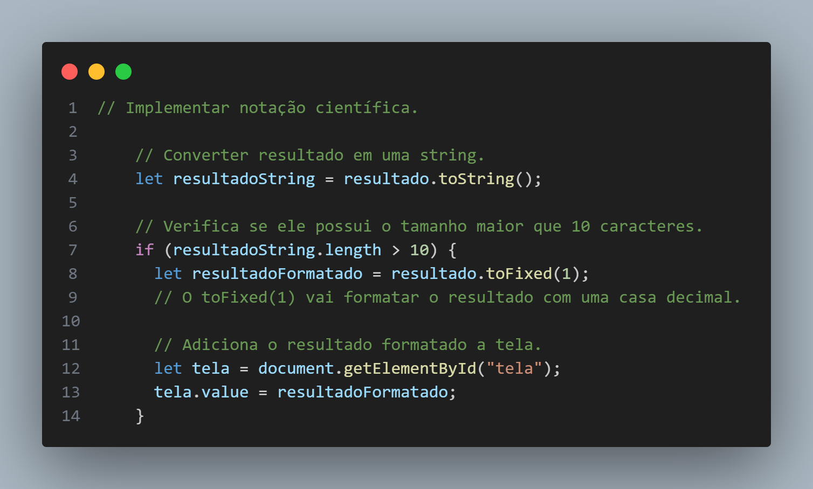

## Introdução

Este projeto é uma calculadora simples criada com HTML, JavaScript e CSS. Foi desenvolvido como parte do aprendizado dessas tecnologias, com foco especial na interação entre botões usando JavaScript.

## Índice:

- [Como impedir a repetição do ponto](#como-impedir-a-repetição-do-ponto)
- [Como evitar a adição de operadores consecutivos](#como-evitar-a-adição-de-operadores-consecutivos)
- [Como implementar notação científica](#como-implementar-notação-científica)

## Dificuldades Enfrentadas 💪

A parte mais desafiadora foi impedir a repetição do ponto e evitar a adição de operadores consecutivos. Além disso, a implementação da notação científica.

## Ver projeto 👀

Acesse o link [aqui](https://brenolira01.github.io/Calculadora-Javascript/).

## Demonstração do Projeto

## Como impedir a repetição do ponto?

Primeiro vamos utilizar o método `includes()`, esse método vai checar se existe um ponto na tela. Em seguida vamos usar uma estrutura de controle `if` e `else` para impedir a inserção do ponto.

Exemplo:

Ou seja, se existe um ponto na tela sua inserção será impedida.

Em seguida vamos pegar "tela.value", valor de tela, e vamos adicionar o botão ponto, "botaoPonto.innerText"

Exemplo:

Resumindo, ficaria assim:

## Como evitar a adição de operadores consecutivos?

Pra isso vamos obter o último caractere da tela utilizando o método `slice()`. Em seguida, usamos o método `includes()` para verificar se ele é um operador.

Exemplo:

Agora que temos o último caractere e sabemos se ele é um operador vamos usar a estrutura de controle`if` e `else` para permitir a substituição caso necessário.

Exemplo:

O trecho "slice(0, -1)" seleciona todos os caracteres da string, exceto o último. Ou seja, é como se estivéssemos apagando o último caractere.

Resumindo, ficaria assim:

## Como implementar notação científica?

Para aplicarmos a notação científica, é necessário definir um limite de tamanho para o resultado.

por exemplo:

Fazendo o calculo 9,6 x 3 = 28.799999999999997, temos o resultado de 18 caracteres. Para que o resultado não seja tão grande podemos usar uma estrutura de controle como `if` e `else`.

Vamos colocar um limite de 10 caracteres, quando ele for ultrapassado, sera feita a notação científica.

Mas antes precisamos converter o resultado do calculo para string para obtermos o seu tamanho. Podemos fazer isso utilizando o método `.toString()`. Assim podemos saber quantos caracteres tem o resultado.

Exemplo:

Agora vamos definir um limite de **10 caracteres**. Também utilizaremos o método `toFixed()` para formatar o resultado em uma casa decimal.

Exemplo:

Resumindo, ficaria assim:

Com isso, temos 9,6 x 3 = **28.8**

## 🧠 Tecnologias Utilizadas

  

## 🔍 Fontes

Os elementos adicionados ou modificados neste projeto foram obtidos de diversas fontes. Abaixo está a lista de onde cada elemento foi encontrado:

- **Ícone de apagar**: Fonte: <a href="https://icon-icons.com/pt/icone/retrocesso/152694" title="retrocesso ícones">Ícones criados por Tailwind Labs - icon-icons</a>
- **Ícone de github**: Fonte: <a href="https://www.flaticon.com/br/icones-gratis/github" title="github ícones">Github ícones criados por Pixel perfect - Flaticon</a>
- **Ícone de linkedin**: Fonte: <a href="https://www.flaticon.com/br/icones-gratis/linkedin" title="linkedin ícones">Linkedin ícones criados por Freepik - Flaticon</a>

Agradeço aos criadores originais por disponibilizarem esses recursos.

## 🌱 Contribuições

Contribuições são bem-vindas! Sinta-se à vontade para abrir problemas e solicitações de pull para melhorar este projeto.

## Autor

Feito por [Francisco Breno](https://www.linkedin.com/in/breno-lira-perfil).

## 📫 Contato

## 📄 Licença

Este projeto é licenciado sob os termos da [Licença MIT](/LICENSE.txt).
Leia o arquivo [LICENSE](/LICENSE.txt) para obter mais detalhes sobre as permissões e restrições da Licença MIT.
