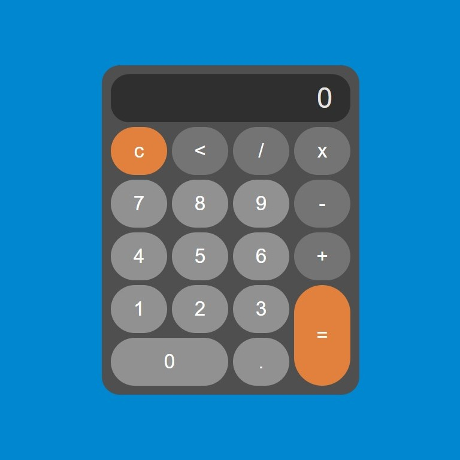

<!DOCTYPE html>
<html lang="en">
<head>
  <meta charset="UTF-8">
  <meta name="viewport" content="width=device-width, initial-scale=1.0">
  
</head>
<body>

 

<h1>Introdução</h1>

Este projeto é uma calculadora simples criada com HTML, JavaScript e CSS. Foi desenvolvido como parte do aprendizado dessas tecnologias, com foco especial na interação entre botões usando JavaScript.

<h2>Como Usar</h2>

1. Acesse o link [aqui](https://brenolira01.github.io/Calculadora-Javascript/).
2. Interaja com a calculadora pressionando os botões.

 

 

<h1>Dificuldades Enfrentadas 💪</h1>

A parte mais desafiadora foi impedir a repetição do ponto e evitar a adição de operadores consecutivos. Além disso, a implementação da notação científica.

 

<h1>Como impedir a repetição do ponto ? 🤔</h1>

Neste trecho de código, verificamos se já existe um ponto na tela com o método includes(). Isso impede a adição de mais de um ponto decimal quando o botão de ponto é clicado.

 

Essa abordagem visa evitar a entrada de números inválidos, garantindo que apenas um ponto decimal seja adicionado à tela.

 

 

<h1>Como evitar a adição de operadores consecutivos ? 🤔</h1>

Neste trecho, obtemos o último caractere da tela para determinar se é um operador. Isso é realizado utilizando o método slice() seguido pelo includes().

 

Posteriormente, com o uso de if e else, verificamos se o último caractere na tela é um operador. Caso seja, permitimos a substituição, possibilitando a troca de um operador por outro, se necessário.

 

 

<h1>Como implementar notação científica ? 🤔</h1>

Para isso, vamos converter o resultado em uma string utilizando .toString(), a fim de obter seu tamanho. Isso nos permite verificar se ele ultrapassa 12 caracteres.

 

Se for maior, utilizamos o método .toFixed() para limitar o resultado a duas casas decimais, e em seguida o adicionamos a tela.

 

 

Decidi utilizar a função new Function() em lugar de eval() por razões de segurança.

 

 

<h2> 🧠 Tecnologias Utilizadas </h2>

<ul>
<li> Html </li>
<li> CSS </li>
<li> JavaScript </li>
</ul>

<h2> Contribuições </h2>

Contribuições são bem-vindas! Sinta-se à vontade para abrir problemas e solicitações de pull para melhorar este projeto.

<h2> Autor </h2>

 Feito por <a href="https://br.linkedin.com/in/breno-lira-b1b0342a9?trk=people-guest_people_search-card" target='_blank'> Francisco Breno </a> 

<h2> Licença </h2>

Este projeto é licenciado sob os termos da [Licença Apache 2.0](/LICENSE.txt).
Leia o arquivo [LICENSE](/LICENSE.txt) para obter mais detalhes sobre as permissões e restrições da Licença Apache 2.0.

</body>
</html>